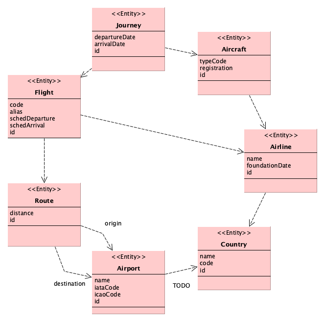

= Project Incubator

NOTE: Research project through small concept tests

== Continuous Integration & QA

[cols="3,4,2", options="header", width="60%"]
|===
|Service
|Link
|Status

| CircleCI
| https://circleci.com/gh/butcherless/incubator[Build CircleCI]
| image:https://circleci.com/gh/butcherless/incubator.svg?style=svg[CircleCI build]

| SemaphoreCI
| https://semaphoreci.com/butcherless/incubator[Build SemaphoreCI]
| image:https://semaphoreci.com/api/v1/butcherless/incubator/branches/master/badge.svg[SemaphoreCI build]

| ShippableCI
| https://app.shippable.com/github/butcherless/incubator[Build ShippableCI]
| image:https://api.shippable.com/projects/5b68c6d57dafeb0700d706c0/badge?branch=master[ShippableCI build]

| TravisCI
| https://travis-ci.org/butcherless/incubator[Build TravisCI]
| image:https://travis-ci.org/butcherless/scala.svg?branch=master[TravisCI build]

| Codecov
| https://codecov.io/gh/butcherless/incubator[Codecov coverage]
| image:https://codecov.io/gh/butcherless/incubator/branch/master/graph/badge.svg[Codecov coverage]
|===

== Neo4j Docker server

.start database:

 docker run --name neo4j -d --rm --publish=7474:7474 --publish=7687:7687 --volume=$HOME/neo4j/data:/data \--volume=$HOME/neo4j/logs:/logs neo4j:3.3.0

.stop database:

 docker stop neo4j

== Scala / Neo4j Integration

* https://dzone.com/articles/getting-started-neo4j-with-scala-annbspintroductio

== Sbt tool

.Build command

 sbt -batch clean assembly

.Run oneOnly (name includes substring)

 repository/testOnly com.cmartin.learn.SlickSpec -- -z populate

.Run testOnly (exact name)

.Scalatest runner details

http://www.scalatest.org/user_guide/using_the_runner#selectingSuitesAndTests

.Debug command

 sbt -batch clean test --debug

.Coverage report

 sbt ";clean;coverage;test;coverageReport"

report:: target/scala-2.12/scoverage-report/index.html

== Subprojects

=== Repository

* Essential Slick 3: http://books.underscore.io/essential-slick/essential-slick-3.html
* Pawel Dolega - A gentle introduction to Slick 3: https://www.youtube.com/watch?v=t1EbXHVJXfs

=== Model

.Model diagram

.Entities

Aircraft:: An airplane capable of flight to transport people and cargo.

.associations
An _Aircraft_ belongs to an _Airline_.

.properties
[cols="1,3", options="header", width="80%"]
|===
|Name
|Description

|typeCode
|code indicating the type of _Aircraft_, B788

|registration
|international code identifying the _Aircraft_, EC-MIG
|===

Airline:: An organization providing a regular public service of air transport on one or more routes.

.properties
[cols="1,3", options="header", width="80%"]
|===
|Name
|Description

|name
|the commercial name of the _Airline_, Iberia

|foundationDate
|the date on which its activity began, 1927-06-28
|===

Airport:: A complex of runways and buildings for the take-off, landing, and maintenance of civil aircraft, with facilities for passengers.

.associations
An _Airport_ belongs to an _Country_.

.properties
[cols="1,3", options="header", width="80%"]
|===
|Name
|Description

|name
|the international name of the _Airport_, Tenerife Norte

|iataCode
|the _Airport_ code for the International Air Transport Association, MAD

|icaoCode
|the _Airport_ code for the International Civil Aviation Organization, LEBL
|===

Country:: A nation with its own government, occupying a particular territory.

.properties
[cols="1,3", options="header", width="80%"]
|===
|Name
|Description

|code
|international two letters code, es, uk, de, us, etc.
|===

Flight:: An act of flying; a journey made through the air or in space, especially a timetabled journey made by an airline.

.associations
A _Flight_ runs through a _Route_.

.properties
[cols="1,3", options="header", width="80%"]
|===
|Name
|Description

|code
|main _Airline_ commercial code, UX9117

|alias
|alternative _Airline_ commercial code, AEA9117

|schedDeparture
|scheduled departure local time, 07:05

|schedArrival
|scheduled arrival local time, 08:55
|===

Journey:: An act of travelling from one place to another.

.associations
A _Journey_ runs through a _Flight_.

A _Journey_ takes place inside an _Aircraft_.

.properties
[cols="1,3", options="header", width="80%"]
|===
|Name
|Description

|departureDate
|real time for departure, 15:23

|arrivalDate
|real time for arrival, 19:41
|===

Route:: A way or course taken in getting from a starting point to a destination.

.associations
A _Route_ has a starting _Airport_ and a destination _Airport_.

.properties
[cols="1,3", options="header", width="80%"]
|===
|Name
|Description

|distance
|number of nautical miles between the two _Airports_, 957 nm.
|===

=== Web

Check web server and API:

- change to project `web`
- start web server using the `reStart` command of the Revolver plugin
- open a console and run the command: `curl -vX GET "http://localhost:8080/api/v1.0/health" -H "accept: application/json"`
- open a browser and access to the URL: http://localhost:8080/api/v1.0/docs
- check log file: `web/target/appFile.log`

== TODO

Finders:

== Plugins
* https://github.com/scoverage/sbt-scoverage/releases
* https://github.com/rtimush/sbt-updates/releases
* https://github.com/sbt/sbt-assembly/releases

== Links
* Thanks to *FlightRadar24*: https://www.flightradar24.com/
* Slick configuration: Logging http://slick.lightbend.com/doc/3.3.1/config.html
* https://github.com/gonmarques/slick-repo (*amazing solution*)
* https://techblog.agrimap.com/slick-3-data-access-patterns-788472e3c77
* Spring data neo4j: https://docs.spring.io/spring-data/neo4j/docs/5.0.5.RELEASE/reference/html/
* Example: https://github.com/bijukunjummen/spring-boot-scala-web
* The great Josh Long: https://github.com/spring-tips/scala/blob/master/src/main/scala/tweets/tweets.scala
* https://spring.io/blog/2017/10/11/spring-tips-bootiful-reactive-scala
* https://github.com/jecklgamis/springboot-scala-example
* https://dadruid5.com/2017/03/22/an-introduction-to-using-spring-with-scala-a-positive-view-with-tips/
* https://docs.spring.io/spring-data/rest/docs/3.0.6.RELEASE/reference/html/
* https://github.com/neo4j/neo4j-ogm
* https://neo4j.com/docs/pdf/cypher-refcard-3.2.pdf
* https://github.com/knoldus/neo4j-scala-starter
* https://dzone.com/articles/getting-started-neo4j-with-scala-annbspintroductio
* https://github.com/spring-guides/gs-accessing-neo4j-data-rest
* https://github.com/spring-tips/scala/blob/master/pom.xml
* https://github.com/dnvriend/spring-boot-with-scala/blob/master/src/main/scala/com/github/dnvriend/repository/BookRepository.scala

== Experimental

Build with seed & bloop server

 docker run -it  --mount type=bind,source="$(pwd),target=/root" tindzk/seed:0.1.6  /bin/sh
